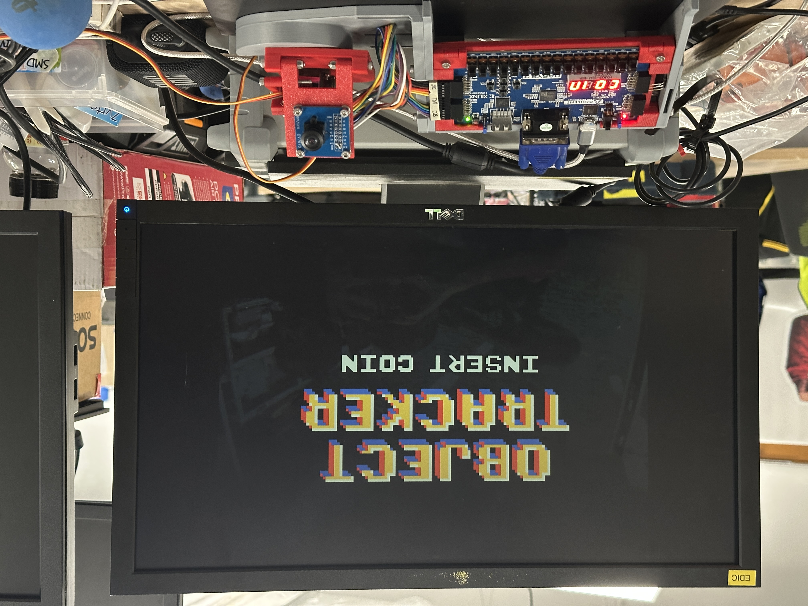

# Object Tracker with FPGA

This project is a real-time, colour-based object tracking system, where frame capture, image filters, blob detection and closed-loop control of a pan-tilt mechanism are all performed on a single Basys3 FPGA board. Parallelism of the FPGA was heavily exploited to track objects with literally _zero_ latency, i.e. the bounding box of a blob is determined at the exact same time as when the last pixel of the image frame is streamed in.

The computer vision (CV) portion of the system is closely integrated with a GUI that streams the live camera feed to a display over VGA, and allows users to customise the filters used as well as modify the blob detection settings of the computer vision pipeline through an intuitive drag-and-drop interface. Thus, this project serves as a gamified educational tool where users can learn about the effects of traditional CV techniques and build an entire object tracking system, all without having to touch a single line of code.

This was for the final project of the NUS module EE2026: Digital Design

## Video Demo

Check out the video demo here: [https://youtu.be/kuJl6z97Nus](https://youtu.be/kuJl6z97Nus)

## Detailed Writeup

Detailed writeup explaining every aspect of the project can be found at [https://tankaicong.com/projects/ee2026/](https://tankaicong.com/projects/ee2026/) and [https://kennethwongcunwi.com/projects/object-tracker-fpga](https://kennethwongcunwi.com/projects/object-tracker-fpga)

