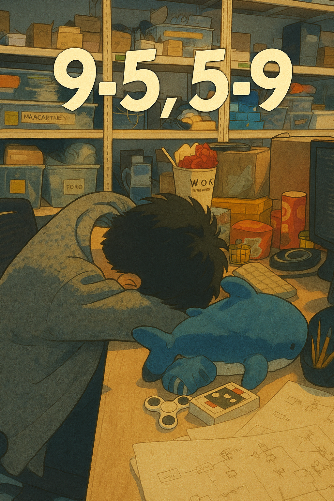

# Gamified CV

A game to create a computer vision pipeline that is used to play an actual game.

## Brain Dump

Dumping all the prominent problems faced here for future writeup

### BRAM story

- Basys3 does not have external memory so I only can work with the 1800 kbits of BRAM in the FPGA. (With some overhead from the BRAM IP block it is even lower around 1.75 kbits)
- Downscaling a 640x480 image down by 4 to 320 by 240, and using RGB444 representation (12 bits) per pixel, because that is what is sent to the VGA too. 320 x 240 x 12 bits = 921600 bits which is more than half the BRAM available!
- First attempt: Use double buffer. Reason: VGA writer runs on 60 Hz while camera writer runs at 30 Hz. So each frame needs to be polled twice while the new frame is being written once. 
    - Shrink image by removing 14 pixels from the left. Also helped since the camera's raw output has a fixed white border on the left side. This means one image takes 306 x 240 = 73440 pixels, or 73440 x 12 = 881280 bits. The full double buffer is 881280 x 2 = 1762560 bits, which reached 100% BRAM utilisation after accounting for some overhead.
    - Problem: Required shifting quite some register arrays to distributed RAM (i.e. LUTRAM), when they should have been naturally inferred as BRAM blocks. LUTRAMs ate up significant LUTs too.
- Removing the bitmap buffer
    - As images were streaming into the upper and lower halves of the double buffer. Colour tresholding was done on the image to generate a 306 x 240 bitmap. Due to the BRAM limits 
- Using single buffer by doubling FPGA

### Realtime pipeline for convolutions

- 3x3 kernel convolution performed by sliding into 2 FIFO queues. The pipeline is:
    - \[R9\] \[R8\] \[R7\] FIFO1\[IMAGE_WIDTH-3\]
    - \[R6\] \[R5\] \[R4\] FIFO2\[IMAGE_WIDTH-3\]
    - \[R3\] \[R2\] \[R1\]

- Each convolution introduces 1 row + 1 pixel of delay
- Currently handled by aligning the final image as needed (e.g. for 3 convolution operations, shift final image by -3 rows, -3 columns)

- Seems like can push the raw pixels into a buffer, while continuing convolution, then once convolution done, throw it into the FIFO queue structure above. Since need 2x rows + 3 pixels before new convolution can start, while convolution only needs 1 row + 1 pixel more time, so should be doable. To be implemented some time